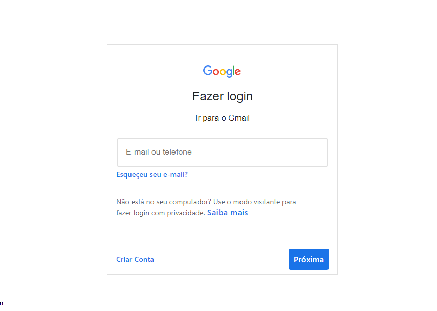
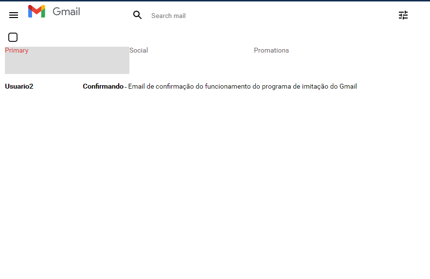

# Imitação do Gmail

Este projeto é uma imitação da página de Login do Gmail e também da Home do mesmo provedor de email.

O serviço web a ser imitado pode ser verificado aqui [Gmail](https://www.gmail.com)

## Login

 Nesta página o usúario para logar com sucesso deverar digitar o email e senhas disponíveis no arquivo [login.json](./src/database/login.json)

### `Avisos!`

   * Caso o usuário digite um email e/ou senha diverso dos cadastrados aparecerá um aviso idêntico ao que a plataforma do Gmail emite, quando o email digitado não foi encontrado e/ou quando a senha está incorreta

   * Não é possível cadastra e-mails, senhas **isso será desenvolvido posteriormente**

## Home

Imitação da Home do Gmail, em que pode-se acessar os email por categória armazenados no arquivo [emails.json](./src/database/emails.json)

### `Avisos!`

   * Não é possível enviar emails pelo sistema **isso será desenvolvido posteriormente**

